  

<h1 align="center">Hi, I'm hhang</h1>

  

  
  
  

---

### Focus

I build and refine personal AI coding workflows, reusable engineering harnesses, and automation templates that make daily development easier to repeat, review, and improve.

- Working on: `claude-everything-Workflow`
- Interested in: AI-assisted development, agent workflows, automation, productivity tooling
- Current mode: working from home, iterating from the terminal

### Stack

  
  
  
  
  
  
  

### Profile in Motion

  <picture>
    <source media="(prefers-color-scheme: dark)" srcset="https://raw.githubusercontent.com/xu91102/xu91102/output/github-contribution-grid-snake-dark.svg" />
    <source media="(prefers-color-scheme: light)" srcset="https://raw.githubusercontent.com/xu91102/xu91102/output/github-contribution-grid-snake.svg" />
    
  </picture>

